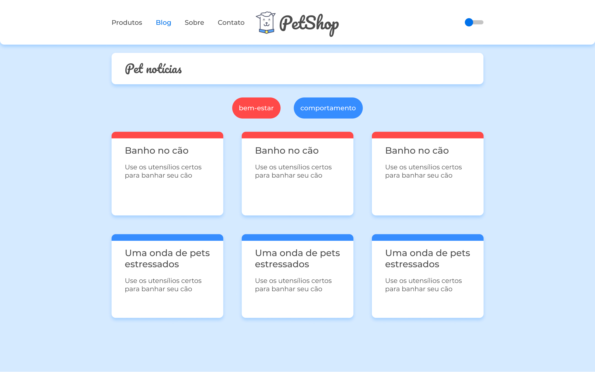

# PetShop
<div>
  
</div>

## Tecnologias
Projeto desenvolvido com as seguintes tecnologias:
- [React](https://reactjs.org/)
- [TypeScript](https://www.typescriptlang.org/)
- [React Router v6](https://reactrouter.com/)
- [styled-components](https://styled-components.com/)
- [Formik](https://formik.org/)

## Como executar
Clone o projeto
```
git clone https://github.com/devanderson-pires/petshop-app.git
```
Acesse a pasta do mesmo e instale as dependências
```
cd petshop-app
yarn
```

Suba a API fake
```
npx json-server --watch db.json --port 5000
```

Abra uma nova aba e inicie o projeto
```
yarn start
```
## Projeto
Aprovetei um projeto do curso de React Router da Alura para refazê-lo do zero e implementar novas funcionalidades.
